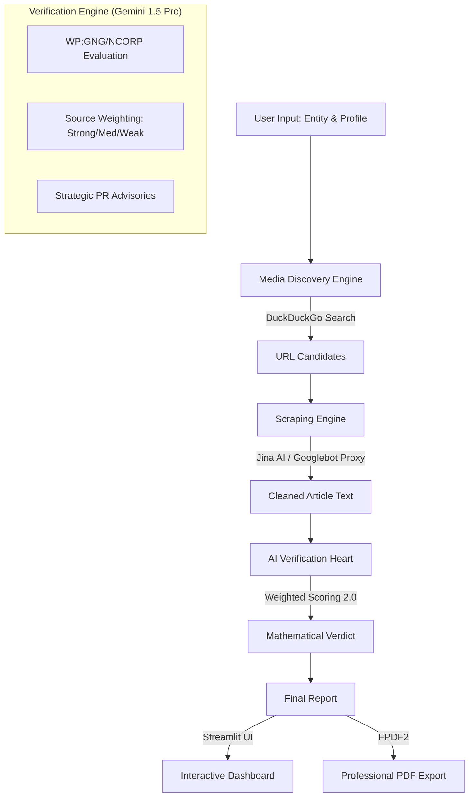

# Wikipedia Notability Verifier 🎓

A professional-grade AI auditing tool designed to simulate Wikipedia's strict administrative inclusion standards. This engine evaluates individuals, companies, and organizations against the **General Notability Guideline (WP:GNG)** and specific thematic policies (WP:CORP, WP:BIO, WP:MUSIC) with mathematical precision.

---

## 🏗 System Architecture



---

## 🚀 Key Features

### 🔍 1. Media Discovery Engine
Automatically scours the web using an integrated search layer to find relevant news features, profiles, and interviews about your subject. It filters for the most promising "hits" to save your PR team hours of manual research.

### 🤖 2. The Verification Heart (Gemini 1.5 Pro)
Uses advanced prompt engineering to simulate a veteran Wikipedia Administrator. Unlike basic LLM checks, this engine is instructed to be **harsh, skeptical, and strictly policy-bound**. It understands the difference between a "routine business announcement" and a "deep-dive investigative feature."

### ⚖️ 3. Weighted Scoring Engine 2.0
We moved away from binary pass/fail logic. Notability is a gradient.
- **[STRONG]**: Long-form investigative profiles.
- **[MEDIUM]**: Routine but reliable reports from **Tier-1 Media** (Reuters, FT, Bloomberg).
- **[WEAK]**: Trivial mentions or niche trade blogs.
- **[NONE]**: Press releases and self-published content.
*The engine mathematically calculates a **Success Probability %** based on the cumulative weight of all provided sources.*

### 📄 4. Enterprise-Grade Reporting
Generates a branded, layout-safe PDF report containing:
- **Final Verdict & Probability Score**
- **Strategic PR Strategy**: Actionable directives for a communications agency.
- **Source Intelligence Breakdown**: Line-by-line justification for why each source helps or hurts.
- **Legal Disclaimers**: Simulates Wikipedia's AfD (Articles for Deletion) grading rubric.

---

## 🛠 Setup & Installation

1. **Clone & Initialize**
   ```bash
   git clone https://github.com/hapkonic-Ai/Verifier-WIKI.git
   cd Verifier-WIKI
   python -m venv venv
   source venv/bin/activate
   pip install -r requirements.txt
   ```

2. **Configuration**
   Create a `.env` file from the template provided:
   ```bash
   cp .env.example .env
   # Add your GEMINI_API_KEY inside the .env
   ```

3. **Launch the Dashboard**
   ```bash
   streamlit run app.py
   ```

---

## 📖 Detailed Usage

1.  **Entity Profile**: Enter the Name, Type (Individual/Company), and a brief background in the sidebar.
2.  **Discovery**: Skip manual URL hunting! Use the **Discovery Engine** tab to find live news links automatically.
3.  **Verification**: Select the URLs you want to evaluate and hit **"Verify Notability."**
4.  **Analysis**: Review the Success Probability and the specific reasons for acceptance or rejection.
5.  **Export**: Click the download button to receive a professional PDF report for your client or internal file.

---

## 📂 Project Structure

- `app.py`: Main Streamlit dashboard and UI logic.
- `verifier.py`: Core AI logic and weighted mathematical scoring engine.
- `scraper.py`: Robust URL scraper with bot protection evasion.
- `pdf_builder.py`: FPDF2 layout system for professional report generation.
- `search_engine.py`: Text-based search discovery layer using `ddgs`.
- `guidelines/`: Directory containing strict markdown versions of WP:GNG, WP:CORP, WP:BIO, and WP:MUSIC.

---

## 🏛 Wikipedia Policies Applied
- **WP:GNG**: General Notability Guideline. 
- **WP:NCORP**: Specific standards for Organizations and Companies (Rejects routine press).
- **WP:BIO**: Specific standards for Biographies.
- **WP:MUSIC**: Standards for Musicians and Bands.

---

## 📃 License
MIT License - Copyright (c) 2026. This tool is provided for advisory purposes. Final inclusion authority rests solely with the Wikipedia administrative community.
